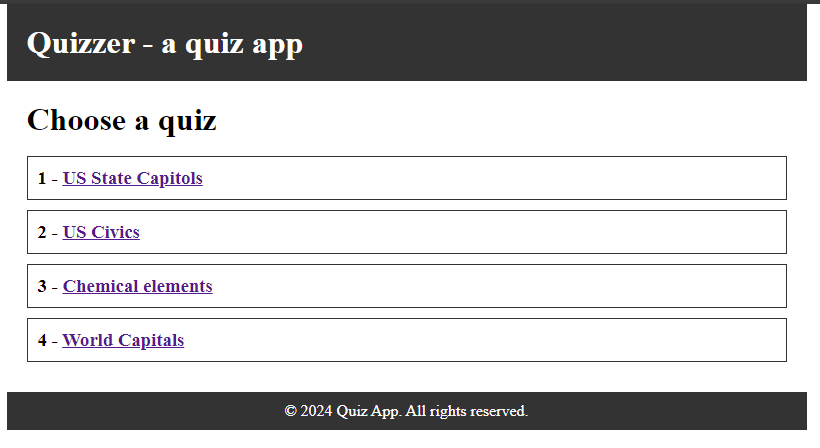
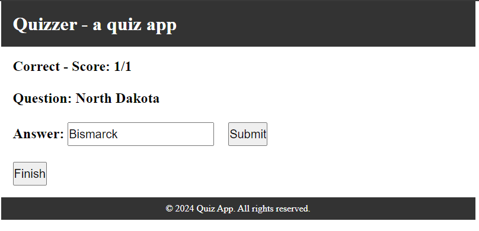
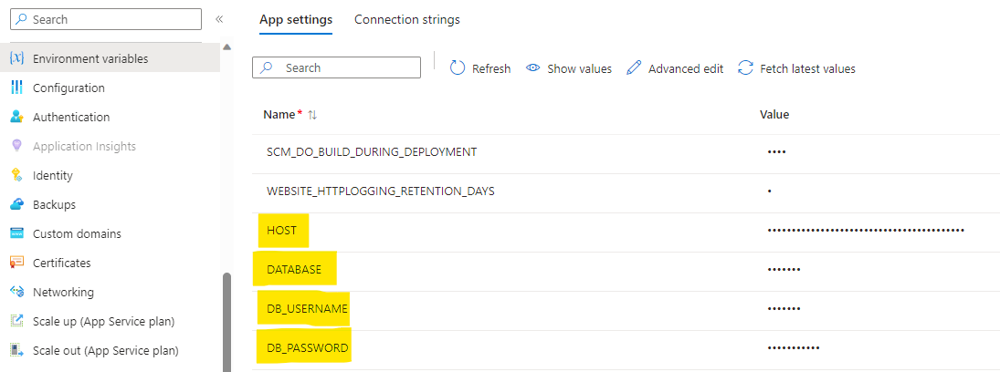
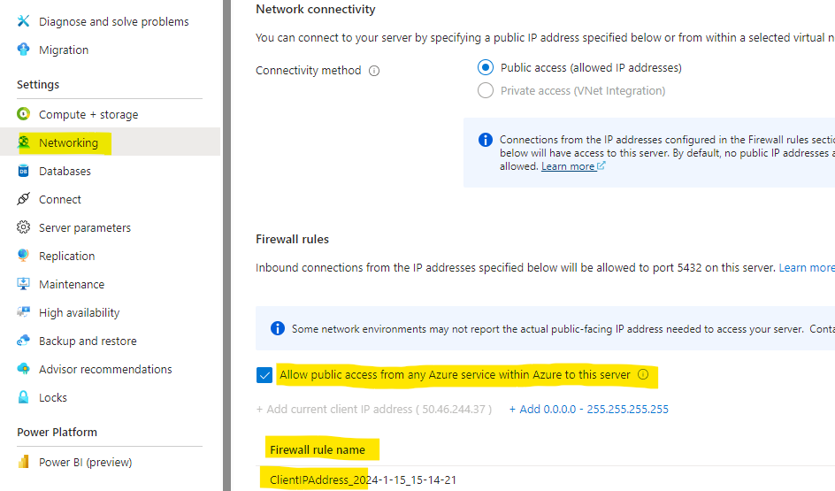

# Quizzer-a quiz app

Python Flask quiz app optimized for memorization training

## Features
- Based on Python Flask web framework
- Session and question management via PostgreSQL (using psycopg2)
- Keeps asking questions until answered correctly
- Or use __Finish__ button ends session with score summary
- Run web app and DB locally or in cloud

## Setup
Set up the app running locally by installing an environment for PostgreSQL and Python Flask. Once it's working and customized, you can choose to upload it to a web app service for remote connection.

### Python and packages
Install latest Python, Flask, and psycopg2 library (for PostgreSQL). Tested with a Debian image in [WSL2](https://learn.microsoft.com/windows/wsl/install). 

E.g. on Debian: 

    sudo apt install python3
    sudo apt install python3-flask
    sudo apt install python3-psycopg2

### PostgreSQL
Install PostgreSQL locally or set up a cloud service. 

E.g. on Debian (in WSL):

    sudo apt install postgresql postgresql-contrib
    # create a postgres user and give it a password
    sudo passwd postgres
    sudo systemctl enable postgresql
    sudo service postgresql start

Create a PostgreSQL user for the quiz app. Enter the psql shell with "sudo -u postgres psql" and run create a SQL user for the database:

    CREATE USER quizzer  with PASSWORD 'your password here'

From here you can use the .sql files to create the database, e.g.

    sudo -i -u postgres psql  < create_db.sql
    sudo -i -u postgres psql -d quiz_db < create_schema.sql

### Create an environment file:
Create a local .env file for the Python programs to use to get PostgreSQL connection details:

    HOST='localhost'
    DATABASE='quiz_db'
    DB_USERNAME='quizzer'
    DB_PASSWORD='your password here'

If your PostgreSQL server is remote or a managed cloud server replace 'localhost' with the hostname (e.g. 'mydbserver.postgres.database.azure.com')

## Loading a quiz

To make a quiz, create a .csv file of the following format:

    question|answer(s)|<number of answers>

If there is more than one possible answer, represent the answer column like a Python list _"[valid answer 1,valid answer 2, valid answer 3]"_. If the user needs to enter more than one answer, increment the _number of answers_ column. Answer validation is case-insensitive.

Examples:

    Alabama|Montgomery|1
    Alaska|Juneau|1

    What is the supreme law of the land?|[the Constitution,Constitution]|1
    What does the Constitution do?|[sets up the government,defines the government,protects basic rights of Americans]|1

    What are two rights in the Declaration of Independence?|[life,liberty,pursuit of happiness]|2

Once you have a quiz, save it as a .csv file in the _subjects_ folder. Set the file name to be the quiz title. Then load the question using load_quiz.py _quiz\ title_. E.g.

    ./load_quiz.py World\ Capitals

The Python script will find the file in the subjects folder and add the .csv extension.

## Running Flask locally
cd to flask directory and run:

    flask run

## Running app in cloud
E.g. to run in Azure App Service. Clone the repo to [Azure Cloud Shell](https://learn.microsoft.com/azure/cloud-shell/overview). cd to the flask folder. Decide which sku and data center location to use. Create an Azure resource group. Then create the app with _az webapp up_. E.g.:

    az group create --name my-quiz-rg --location westus3
    az webapp up --runtime PYTHON:3.9 --sku B1 --logs -g my-quiz-rg -l westus3 --name my-quiz-app

Notes: 

- The sku you select will affect the monthly cost. Use _F1_ for the free plan. See [App Service on Linux pricing](https://azure.microsoft.com/pricing/details/app-service/linux/) for details.

- The app will not run successfully in Azure App Service until you set the web app environment variables to the correct values to connect to the PostgreSQL database and restart the app:

- If using [Azure Database for PostgreSQL flexible server](https://learn.microsoft.com/azure/postgresql/flexible-server/overview) for the database, set a firewall rule to allow local development if needed, and allow public access from any Azure service with Azure. E.g.

